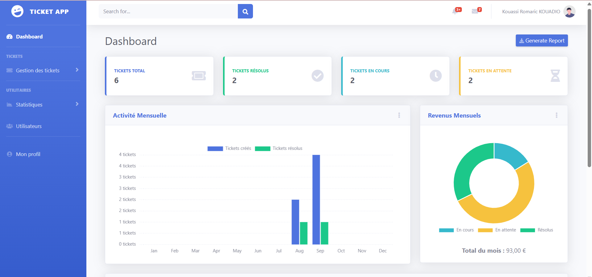
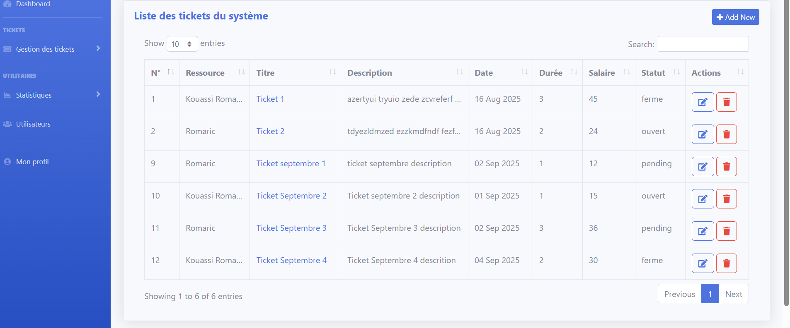
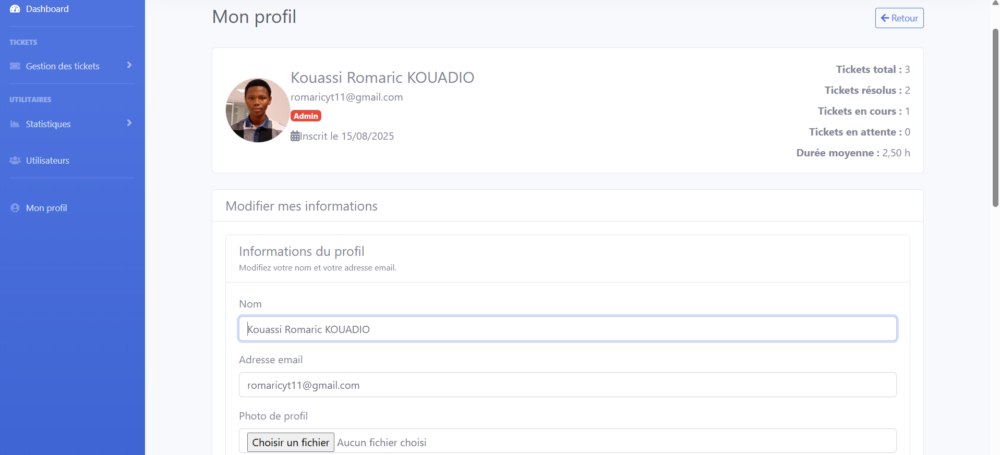

# TICKET APP – Application de gestion des tickets

TICKET APP est une application Laravel conçue pour gérer les tickets de support, les statistiques d’activité, et les rôles administratifs et les profils utilisateurs. Elle intègre un système complet d’authentification, d’upload d’avatars, et de visualisation des données.

## Fonctionnalités principales

-   Authentification sécurisée (login, inscription, mot de passe oublié, vérification email)
-   Gestion des profils utilisateurs avec avatar
-   Système de tickets (création, suivi, résolution)
-   Statistiques dynamiques par utilisateur
-   Rôles : utilisateur standard et administrateur
-   Upload et affichage d’images (avatars)
-   Notifications par email (réinitialisation, vérification)

## Technologies utilisé

-   Laravel 10 : Backend & logique métier
-   Breeze : Authentification
-   Bootstrap 5 : Interface utilisateur
-   Font Awesome: Icônes
-   Laravel Storage : Gestion des fichiers (avatars)
-   Blade : Templates
-   Eloquent ORM : Modèles et relations
-   MySQL : Base de données

## Installation
 ```bash
git clone https://github.com/Kromaric/ticket_laravel.git
cd ticket_laravel
composer install
npm install && npm run dev
cp .env.example .env
php artisan key:generate
 ```

Configure ta base de données dans .env, puis :
 ```bash
php artisan migrate
php artisan storage:link
 ```
## Authentification

L’application utilise Laravel Breeze pour gérer :

-   Connexion / Déconnexion
-   Inscription
-   Réinitialisation du mot de passe
-   Vérification de l’adresse email
-   Confirmation du mot de passe avant action sensible

### Upload d’avatar

Les utilisateurs peuvent uploader une image de profil via leur page "Mon profil".
L’image est stockée dans storage/app/public/avatars et accessible via /storage/avatars/....
Validation côté serveur :
'avatar' => ['nullable', 'image', 'max:2048'],

## Système de tickets

Chaque utilisateur peut consulter ses statistiques :

-   Total de tickets
-   Tickets résolus
-   Tickets en cours
-   Tickets en attente
-   Durée moyenne de traitement
    Les administrateurs peuvent accéder à la gestion globale des tickets.

## Rôles

Deux rôles sont définis :

-   admin : accès à toutes les fonctionnalités
-   user : accès limité à son propre profil et ses tickets

## Emails

L’application envoie des emails pour :

-   Vérification d’adresse
-   Réinitialisation du mot de passe
    configurer ton service mail dans .env :
    ```bash
    MAIL_MAILER=smtp
    MAIL_HOST=smtp.mailtrap.io
    MAIL_PORT=2525
    MAIL_USERNAME=...
    MAIL_PASSWORD=...
    MAIL_FROM_ADDRESS="noreply@monapp.com"
    MAIL_FROM_NAME="Ticket App"
     ```

## Tests

Tu peux lancer les tests avec :
php artisan test

## Routes utiles
 ```bash
| /login 
| /register 
| /dashboard 
| /profile
| /tickets 
| /email/verify 
| /forgot-password
 ```

## Aperçu visuel

L’interface est construite avec Bootstrap 5 et SB ADMIN 2, avec un design responsive et moderne.
Les pages d’authentification ont été entièrement personnalisées pour une meilleure expérience utilisateur.




## Licence

Ce projet est PRIVE Veillez me contecter par mail romaricyt11@gmail.com pour toute question le concernant.
